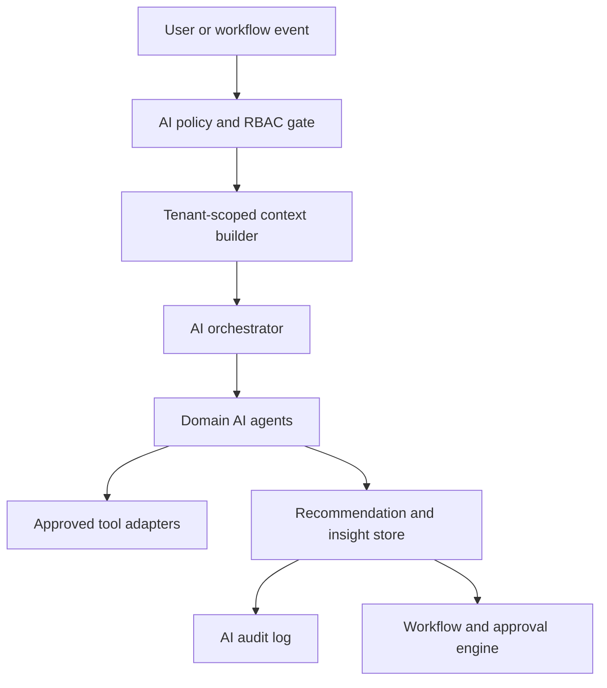

# ASTRA AI Agent Architecture

## Purpose

This document defines the AI architecture for ASTRA as an enterprise operating system. The goal is practical AI assistance across finance, procurement, operations, compliance, audit, and executive decision-making while preserving tenant isolation, RBAC, auditability, and human control.

## AI Design Principles

- AI assists business users; it does not bypass business controls.
- AI reads only tenant-scoped, permission-allowed context.
- AI recommendations must be traceable to source records, workflow state, and prompt category.
- Material actions require human approval unless explicitly configured as low-risk automation.
- AI outputs should be stored as operational evidence when they influence decisions.
- Every AI agent must have a clear domain, allowed tools, escalation rules, and audit trail.

## AI Layer Overview

## AI Orchestration Layer

The AI orchestrator is the control point for all model-powered work.

Responsibilities:

- Select the correct agent for the task.
- Build a scoped context package.
- Apply tenant, user, role, and permission constraints.
- Select model, prompt template, tools, and output schema.
- Enforce safe action policies.
- Route high-risk recommendations into approval workflows.
- Store prompt metadata, input references, output, confidence, and user feedback.

The orchestrator should support synchronous and asynchronous modes:

- Synchronous: dashboard summaries, inline recommendations, copilot chats.
- Asynchronous: anomaly detection, forecast refresh, audit pack generation, risk scans.

## Agent Hierarchy

### 1. Enterprise AI Orchestrator

The top-level coordinator. It does not own domain logic. It routes requests, applies policy, and records evidence.

Core functions:

- Agent selection.
- Tool permissioning.
- Context assembly.
- Risk classification.
- Human approval routing.
- Audit capture.

### 2. Domain Agents

Domain agents understand business context and produce recommendations.

- AI CFO.
- AI Auditor.
- AI Procurement Manager.
- AI Operations Manager.
- AI Compliance Officer.
- AI Executive Copilot.

### 3. Specialist Agents

Specialist agents support narrow tasks:

- Forecasting agent.
- Anomaly detection agent.
- Document summarization agent.
- Policy matching agent.
- Workflow routing agent.
- Data reconciliation agent.
- Board narrative agent.

### 4. Tool Adapters

Tool adapters expose approved platform actions to agents.

Examples:

- Read workflow status.
- Read finance impact.
- Fetch audit logs.
- Create draft recommendation.
- Open risk alert.
- Prepare board MIS summary.
- Draft approval comment.
- Request missing evidence.

Tool adapters must enforce tenant scope, RBAC, input validation, idempotency, and audit logging.

## Core AI Agents

### AI CFO

Primary users:

- CFO.
- Finance manager.
- Executive leadership.

Responsibilities:

- Cash runway analysis.
- Working capital visibility.
- Budget utilization review.
- Margin and revenue forecast summaries.
- Payment timing and collections risk.
- R2R close readiness.
- Finance impact explanation for operational decisions.

Inputs:

- Ledger, journal, payment, invoice, collection, budget, and forecast records.
- P2P, OTC, and R2R workflow status.
- Executive KPIs and Board MIS packs.

Outputs:

- Cash risk alerts.
- Forecast commentary.
- Close readiness score.
- Payment release recommendations.
- Board finance narrative.

Controls:

- Cannot post journals or release payments directly.
- Can draft finance actions for human approval.
- Must label forecast confidence and key drivers.

### AI Auditor

Primary users:

- Auditor.
- Finance controller.
- Compliance team.
- Organization admin.

Responsibilities:

- Audit trail completeness review.
- Segregation of duties detection.
- Missing evidence identification.
- Policy exception detection.
- Approval chain review.
- Close control and access review support.

Inputs:

- Audit logs, workflow events, approval records, access roles, evidence attachments, and policy rules.

Outputs:

- Audit findings.
- Evidence gap lists.
- Control health summary.
- Exception severity.
- Suggested remediation workflow.

Controls:

- Cannot delete or alter audit logs.
- Cannot approve its own findings.
- Must preserve source references for every finding.

### AI Procurement Manager

Primary users:

- Procurement manager.
- Finance manager.
- Vendor owner.

Responsibilities:

- Spend variance detection.
- Vendor risk scoring.
- Duplicate invoice detection.
- Purchase policy checks.
- Vendor onboarding guidance.
- Supplier performance summaries.

Inputs:

- Requisitions, POs, GRNs, invoices, vendors, contracts, payments, budget rules, and SRM records.

Outputs:

- Procurement risk alerts.
- Vendor onboarding summary.
- Negotiation insights.
- Spend optimization recommendations.
- Approval comments.

Controls:

- Cannot create or approve POs above configured thresholds.
- Cannot change vendor bank details.
- Must route high-value exceptions for human review.

### AI Operations Manager

Primary users:

- Operations manager.
- Warehouse manager.
- Production planner.
- Quality lead.

Responsibilities:

- Inventory and warehouse exception detection.
- Production schedule risk.
- Dispatch SLA risk.
- Quality anomaly detection.
- Capacity and stockout forecasting.
- Operational KPI commentary.

Inputs:

- Inventory balances, stock movements, GRNs, dispatches, BOMs, production plans, QC checks, tickets, and operational workflows.

Outputs:

- Stockout alerts.
- Dispatch delay risks.
- Production plan risks.
- Quality issue clusters.
- Suggested corrective actions.

Controls:

- Cannot adjust stock directly.
- Cannot release quality holds without approval.
- Must preserve evidence for operational recommendations.

### AI Compliance Officer

Primary users:

- Compliance officer.
- Legal.
- Internal audit.
- Department owners.

Responsibilities:

- Compliance obligation mapping.
- Control evidence review.
- Policy exception triage.
- Remediation follow-up.
- Regulatory reporting preparation.
- Vendor and access compliance checks.

Inputs:

- Controls, obligations, policies, evidence, audit logs, access records, vendor records, and workflow status.

Outputs:

- Compliance risk summary.
- Missing evidence requests.
- Remediation recommendations.
- Policy exception reports.
- Control readiness score.

Controls:

- Cannot mark controls effective without owner signoff.
- Cannot suppress findings without auditable approval.
- Must retain source references.

### AI Executive Copilot

Primary users:

- CEO.
- CFO.
- Board members.
- Executive staff.

Responsibilities:

- Executive KPI synthesis.
- Board MIS narrative.
- Strategic insight generation.
- Enterprise risk summaries.
- Forecast and anomaly explanation.
- Decision prompt preparation.

Inputs:

- Executive KPIs, forecasts, anomalies, module dashboards, finance impact, audit findings, and strategic initiatives.

Outputs:

- CEO summary.
- CFO summary.
- Board pack commentary.
- Strategic options.
- Risk-adjusted recommendations.
- Questions for management review.

Controls:

- Cannot hide material risk.
- Must distinguish facts, forecasts, and recommendations.
- Must show confidence and key assumptions.

## AI Workflow Lifecycle

1. Observe: event, user request, schedule, dashboard load, or workflow state triggers AI.
2. Scope: tenant, user, roles, permissions, module, and data boundaries are resolved.
3. Retrieve: context builder fetches allowed records, summaries, metrics, and evidence.
4. Reason: selected agent generates structured output.
5. Validate: schema validation, policy checks, safety checks, and confidence thresholds run.
6. Recommend: output is stored as insight, alert, draft, comment, or forecast.
7. Approve: human owner accepts, rejects, edits, or escalates material actions.
8. Execute: approved actions call normal platform APIs.
9. Audit: prompt metadata, source references, output, and user decision are recorded.
10. Learn: feedback improves prompts, thresholds, templates, and evaluations.

## AI Memory and Context

ASTRA should separate durable facts from AI memory.

Durable facts:

- Business records.
- Workflow state.
- Audit logs.
- Finance impact.
- Evidence files.
- User and role assignments.

AI memory:

- User preferences.
- Repeated decision patterns.
- Summarized prior recommendations.
- Feedback on useful or rejected suggestions.

AI memory must be tenant-scoped, permission-aware, erasable when required, and excluded from statutory records unless formally attached as evidence.

## AI Risk and Exception Model

AI-generated risk signals should follow a shared model:

- Severity: low, medium, high, critical.
- Confidence: numeric or banded score.
- Impact area: finance, compliance, operations, customer, vendor, security, audit.
- Source records: referenced IDs, not broad data dumps.
- Recommended action: short, concrete next step.
- Owner role: who should decide.
- Status: open, acknowledged, resolved, archived.
- Audit link: trace to AI run and user action.

## Human-in-the-Loop Controls

Human approval is required for:

- Payment release.
- Journal posting.
- Vendor bank detail changes.
- Role or permission changes.
- Quality hold release.
- Contract or pricing changes.
- Compliance control signoff.
- Board MIS approval.
- External communication sent on behalf of ASTRA users.

Low-risk AI automation may be allowed for:

- Drafting comments.
- Summarizing records.
- Classifying tickets.
- Preparing evidence checklists.
- Creating non-material reminders.
- Suggesting workflow owner reassignment.

## AI Evaluation Strategy

Evaluation should be part of production readiness.

Evaluate:

- Accuracy against known records.
- Hallucination and unsupported claims.
- Tenant isolation.
- RBAC enforcement.
- Sensitivity to missing context.
- Consistency of severity labels.
- Recommendation usefulness.
- False positive and false negative rates for anomalies.

Evaluation assets:

- Golden datasets per module.
- Scenario prompts.
- Red-team prompts.
- Expected output schemas.
- Regression test runs.
- Human reviewer feedback.

## AI Audit Requirements

Every AI run that influences business decisions should capture:

- Tenant and user context.
- Agent name and prompt template version.
- Model family and configuration.
- Tool calls and source record references.
- Output schema and result.
- Confidence and severity.
- User action taken.
- Timestamp, request ID, and correlation ID.

Sensitive prompt contents should be stored with redaction where required.

## Implementation Guardrails

- Do not allow unrestricted natural-language database access.
- Do not let agents call tools outside their domain and role policy.
- Do not store full sensitive documents in prompt logs.
- Do not treat AI confidence as approval authority.
- Do not use AI summaries as a replacement for source records.
- Do not train cross-tenant models on customer data without explicit contractual permission.
