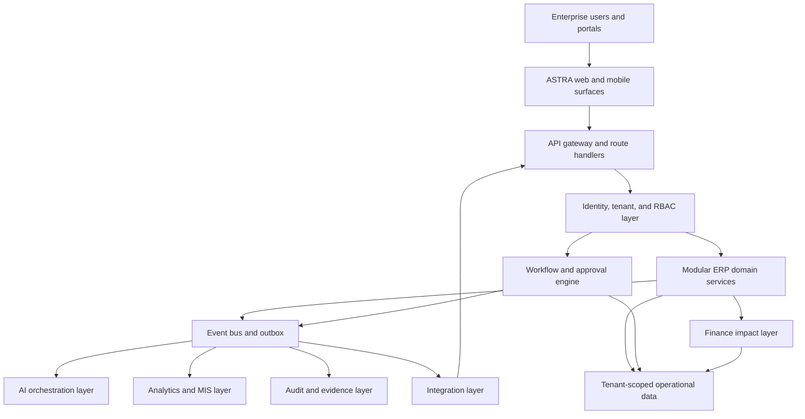

# ASTRA Super ERP Architecture Blueprint

## Purpose

This blueprint defines the future architecture of ASTRA as a modular AI-powered enterprise operating system. It is intended to guide product planning, engineering execution, implementation partners, and enterprise buyers without forcing premature implementation choices.

ASTRA should evolve as an operating layer that connects enterprise workflows, finance impact, operational execution, audit evidence, analytics, and AI copilots in one governed platform.

## Enterprise Operating System Vision

ASTRA is not only an ERP application. It is an enterprise operating system that helps organizations answer five operating questions:

- What work is happening?
- Who owns the next decision?
- What is blocked, risky, or overdue?
- What is the finance, compliance, or customer impact?
- What evidence exists for audit, reporting, and board review?

The platform should provide a shared control plane across finance, procurement, revenue, operations, production, supplier management, customer management, compliance, user operations, and executive intelligence.

## Architecture Principles

- Modular first: every ERP domain should be independently deployable at the product level, even if it runs on a shared platform.
- Workflow-native: records should move through stages, approvals, exceptions, and audit trails by default.
- Finance-aware: operational events should expose cash, revenue, margin, liability, and budget impact where relevant.
- AI-assisted, human-controlled: AI should recommend, summarize, detect, forecast, and draft actions; governed users approve material actions.
- Tenant-safe: every request, job, event, report, integration, and AI prompt must be scoped to a tenant and role.
- API-first: core capabilities should be reachable through stable APIs, webhooks, event streams, and integration adapters.
- Audit by design: every critical action should produce durable, searchable, exportable evidence.
- Practical customization: configuration should cover common variation; code plugins should be reserved for deeper enterprise extension.

## Core Architecture

### 1. Platform Core

The platform core provides shared services used by every module:

- Tenant context and organization boundaries.
- User, role, permission, department, and membership management.
- Workflow stages, approvals, SLAs, escalations, and task ownership.
- Audit logs, activity logs, domain events, and evidence capture.
- Notifications and reminders.
- Configuration, custom fields, templates, and feature flags.
- Reporting, exports, and dashboard shell.
- Integration credentials, sync logs, and webhook endpoints.

### 2. Modular ERP Architecture

Each ERP module should follow the same internal structure:

- Domain records: durable business entities such as purchase orders, invoices, stock movements, sales opportunities, production plans, or compliance controls.
- Workflow stages: lifecycle states and ownership transitions.
- Approval flows: role-based and threshold-based approval rules.
- Exceptions: risk, anomaly, missing evidence, duplicate, overdue, and policy violation signals.
- Finance linkage: budget, cash, revenue, cost, liability, tax, or margin impact.
- Audit events: immutable action history and evidence references.
- AI insights: summaries, forecasts, recommendations, and exception reasoning.
- Analytics views: operational KPIs and management reporting outputs.

### 3. Workflow Engine Architecture

The workflow engine should remain the common execution backbone:

- Workflow definition: versioned process templates with stages and transitions.
- Workflow instance: one running business process tied to a tenant and domain record.
- Step assignment: owner, approver, backup approver, service user, or AI agent.
- SLA policy: due dates, breach status, escalation rules, and reminders.
- Approval policy: amount thresholds, department rules, role hierarchy, segregation of duties, and exception overrides.
- Evidence policy: required documents, comments, system checks, and AI-generated rationale.
- State machine: only valid transitions can move records forward.
- Audit integration: every transition, approval, rejection, reassignment, and AI recommendation is logged.

### 4. AI Orchestration Layer

The AI layer should sit above the domain services, not bypass them.

- AI Orchestrator: routes tasks to the right agent, model, prompt, tools, and policy checks.
- Domain agents: AI CFO, AI Auditor, AI Procurement Manager, AI Operations Manager, AI Compliance Officer, and AI Executive Copilot.
- Tool adapters: safe read/write actions against approved APIs.
- Context builder: retrieves tenant-scoped records, workflow state, documents, analytics, and audit history.
- Risk policy: blocks unsafe actions, enforces human approval, and labels uncertainty.
- Output registry: stores AI summaries, recommendations, risk scores, forecasts, and prompt metadata for traceability.

AI should never write directly to core records without going through governed service APIs and approval controls.

### 5. Event-Driven Architecture

ASTRA should use events to connect modules without tight coupling.

Core event types:

- Record created, updated, submitted, approved, rejected, closed, canceled.
- Workflow step assigned, completed, escalated, breached.
- Finance impact calculated or posted.
- Audit evidence attached.
- Risk alert raised, acknowledged, resolved.
- Integration sync started, completed, failed.
- AI recommendation generated, accepted, dismissed.

Implementation pattern:

- Domain services write business records in a transaction.
- The same transaction writes event outbox rows.
- Background workers publish outbox rows to subscribers.
- Subscribers update analytics, notifications, integrations, AI queues, and audit summaries.
- Events remain tenant-scoped and replayable.

### 6. Audit Architecture

The audit architecture should support operational review, statutory audit, SOC controls, and board governance.

Audit layers:

- Authentication audit: login, logout, session refresh, MFA, failed attempts.
- Authorization audit: permission checks, role changes, access denials.
- Workflow audit: submissions, approvals, rejections, escalations, evidence changes.
- Domain audit: material record changes and financial impacts.
- AI audit: prompt category, model, input source references, generated recommendation, confidence, user action.
- Integration audit: external system calls, payload references, retries, errors.

Audit design rules:

- Store before and after snapshots for material changes.
- Use immutable timestamps and actor identifiers.
- Capture tenant, resource, action, severity, IP, user agent, correlation ID, and request ID.
- Keep sensitive payloads redacted or referenced through secure evidence storage.
- Provide export-ready audit reports by module, user, period, and resource.

### 7. Analytics Architecture

ASTRA analytics should combine operational metrics, finance metrics, workflow metrics, AI signals, and audit evidence.

Analytics layers:

- Operational reporting: live dashboards powered by transactional data.
- Management analytics: curated aggregates for module owners.
- Executive MIS: CEO, CFO, and Board-level views.
- Predictive analytics: forecasts, risk trends, anomaly patterns, cash timing, demand and capacity signals.
- Data warehouse readiness: event streams and stable reporting views for external BI.

Core KPI families:

- Cycle time, SLA breach rate, pending approvals, exception volume.
- Spend, revenue, margin, cash impact, budget utilization, working capital.
- Inventory turns, stockout risk, dispatch performance, production adherence, quality yield.
- Control health, audit readiness, policy exceptions, access risk.
- Customer pipeline, vendor risk, support health, contract renewal exposure.

### 8. Integration Architecture

The integration layer should support both SME simplicity and enterprise extensibility.

Integration types:

- Identity providers: SSO, SAML, OIDC, SCIM.
- Finance systems: ledgers, tax systems, payment gateways, banks.
- ERP and CRM systems: SAP, Oracle, Tally, Zoho, Salesforce, Microsoft Dynamics.
- Supply chain systems: WMS, barcode/RFID systems, logistics providers.
- Productivity systems: email, calendar, document storage, chat.
- Data platforms: warehouses, BI tools, lakehouses.

Integration rules:

- Use tenant-scoped credentials and encrypted secret storage.
- Prefer idempotent sync APIs and replayable webhooks.
- Track sync status, retries, error payload references, and reconciliation state.
- Isolate integration failures from core workflows.
- Provide manual retry and support diagnostics.

## ERP Module Blueprint

| Module | Primary Purpose | Core Records | Workflow Examples | AI Signals |
| --- | --- | --- | --- | --- |
| P2P Procure to Pay | Control spend from request to vendor payment | Requisitions, POs, GRNs, vendor invoices, payments | Purchase approval, invoice matching, payment release | Duplicate invoice, price variance, vendor risk, cash timing |
| OTC Order to Cash | Manage revenue from order to collection | Quotes, orders, dispatches, invoices, collections, disputes | Order approval, credit hold, billing, collections | Revenue forecast, overdue risk, dispute likelihood |
| R2R Record to Report | Govern accounting close and reporting | Journals, reconciliations, close tasks, reports | Journal approval, reconciliation signoff, close checklist | Close risk, anomaly entries, missing evidence |
| CRM | Manage leads, customers, opportunities, and support | Leads, accounts, contacts, opportunities, tickets | Lead qualification, deal approval, support escalation | Pipeline forecast, churn risk, account health |
| SRM | Manage vendors, onboarding, compliance, and performance | Vendors, onboarding cases, contracts, risk reviews | Vendor onboarding, compliance renewal, performance review | Vendor risk, SLA drift, concentration exposure |
| Inventory | Track stock, valuation, and movement | Items, lots, stock balances, movements, adjustments | Stock transfer, adjustment approval, cycle count | Stockout risk, dead stock, variance anomaly |
| Warehouse | Manage inbound, storage, picking, and dispatch | Warehouses, bins, receipts, picks, dispatches | GRN, putaway, pick-pack-ship | Dock congestion, dispatch SLA risk |
| Production | Plan and execute manufacturing | BOMs, routings, plans, work orders, output | Plan approval, work order release, variance review | Capacity risk, schedule slip, cost variance |
| Quality | Control inspection, defects, holds, CAPA | QC checks, nonconformance, holds, CAPA | Inspection, hold release, corrective action | Yield anomaly, supplier lot risk |
| HR/User Operations | Govern employees, access, and operating roles | Users, roles, departments, access requests, tasks | User onboarding, access approval, role review | Access risk, orphaned role, workload imbalance |
| Compliance | Manage policies, controls, evidence, and audits | Controls, obligations, evidence, findings, remediation | Control testing, policy exception, remediation | Control failure risk, audit gap, regulatory exposure |
| Board/Executive MIS | Provide executive visibility and decision support | KPIs, forecasts, board packs, strategic insights | MIS preparation, CFO signoff, board approval | Forecast variance, enterprise risk, strategic recommendations |

## Platform Strategy

### Multi-Tenant SaaS Architecture

ASTRA should run as a multi-tenant SaaS platform with strict tenant boundaries in authentication, authorization, data access, background jobs, events, files, analytics, and AI context building. Larger enterprise customers may require dedicated database, dedicated region, private networking, or single-tenant deployment options.

### Industry Templates

Industry templates should configure the platform for repeatable operating models:

- Manufacturing: BOM, production, QC, warehouse, P2P, costing, dispatch.
- Distribution: inventory, warehouse, dispatch, OTC, vendor performance.
- Professional services: approvals, projects, finance, utilization, customer operations.
- Retail and ecommerce: inventory, order flow, returns, customer support.
- Healthcare and regulated services: compliance, audit evidence, vendor controls, access governance.

### Customization Engine

Customization should be layered:

- Configuration: roles, stages, approvals, fields, dashboards, reports.
- Templates: industry packages and module starter kits.
- Low-code rules: thresholds, formulas, routing, notifications, validations.
- Plugins: controlled extensions for custom screens, integrations, and domain actions.
- APIs: external systems can create, update, approve, query, and subscribe to records.

### Plugin Architecture

Plugins should have explicit scopes:

- UI extensions: additional dashboards, panels, widgets, forms.
- Domain actions: custom business operations through approved service APIs.
- Integration adapters: connectors to external systems.
- AI tools: tenant-approved read/write tools callable by AI agents.
- Reporting packs: custom MIS, statutory, or board reporting outputs.

Plugins must be tenant-aware, permission-checked, versioned, auditable, and removable.

### API-First Strategy

Every major module should expose stable APIs for:

- Record creation, query, update, and state transitions.
- Workflow actions and approvals.
- Audit log retrieval.
- Attachments and evidence references.
- AI insights and recommendations.
- Webhook subscription and event delivery.
- Bulk import and export.

### Mobile Strategy

Mobile should prioritize high-frequency workflows:

- Approvals, comments, evidence upload, notifications.
- Inventory scans, GRN, dispatch, quality checks.
- Field operations and service tickets.
- Executive KPI review and alert acknowledgement.

Mobile should use the same tenant, RBAC, audit, workflow, and API layers as web.

## Business Strategy

### SME Roadmap

SME packaging should emphasize fast activation:

- Start with approvals, finance controls, P2P, OTC, R2R, inventory basics, and executive MIS.
- Use opinionated templates and guided setup.
- Offer simple pricing by tenant, module, and active users.
- Include AI copilots as practical assistants, not separate implementation projects.

### Enterprise Roadmap

Enterprise packaging should emphasize governance:

- SSO, SCIM, advanced RBAC, audit exports, custom retention, private networking.
- Dedicated data environments and regional deployment options.
- Advanced workflow rules, integration adapters, data warehouse feeds.
- AI governance controls, evaluation, and human approval.

### Industry Adaptation Roadmap

Prioritize industries where workflow, finance impact, and audit evidence are strong buying triggers:

1. Manufacturing and assembly.
2. Distribution and wholesale.
3. Professional services and project operations.
4. Regulated services.
5. Retail and ecommerce operations.

### Monetization Roadmap

Potential pricing dimensions:

- Platform base subscription.
- Module subscriptions.
- User tiers: viewer, operator, approver, admin, executive.
- AI usage and premium agents.
- Integration packs.
- Industry templates.
- Enterprise controls and dedicated deployment.

### Deployment Strategy

Deployment options should scale with customer maturity:

- Shared SaaS for SMEs and standard mid-market customers.
- Enterprise SaaS with dedicated database and region controls.
- Private cloud or VPC deployment for regulated enterprises.
- Hybrid integration bridge for customers with on-prem systems.

## Execution Guardrails

- Do not duplicate workflow, audit, RBAC, notification, or AI logic inside individual modules.
- Do not let AI bypass approval and audit controls.
- Do not create industry forks; use templates and plugins.
- Do not add module-specific integration hacks; route through integration adapters.
- Do not expose cross-tenant analytics unless explicitly anonymized and contractually permitted.
- Treat finance impact and audit evidence as first-class platform capabilities.
